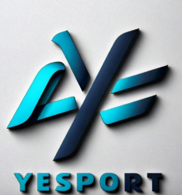

# Yesport 
"*Este es un proyecto de React que utiliza context, react-router-dom y firebase para gestionar datos*"

--- 
## 🛠️ Tecnologias utilizadas
- **React**: Framework de Javascript para construir interfaces de usuario.
- **Vite**: Herramienta de compilacion de frontend extremadamente rápida.
- **React Router DOM**: Utilizado para el manejo de rutas.
- **Firebase**: Base de datos y autenticación

---

## 📂 Estructura del proyecto
src/
* componentes/
* context/
* hooks/
* services/
* App.jsx

---
## 🚀 Instalación

Sigue estos pasos para configurar el proyecto en tu máquina local:

### Clona el repositorio
```bash
git clone https://github.com/Yoli1758/reactjs-63390-terceraentrega.git
cd ecommerce

instala dependecias
npm install
Ejecuta el proyecto
npm run dev


```

# Caracteristicas
. Gestion de ordenes y productos con Firebase

. Navegacion con React Router DOM.

📞 **Contacto**

Autor: Espinoza Yolimar

Email: yolimar.espinoza868ar@gmail.com

GitHub: Yoli1758


[]